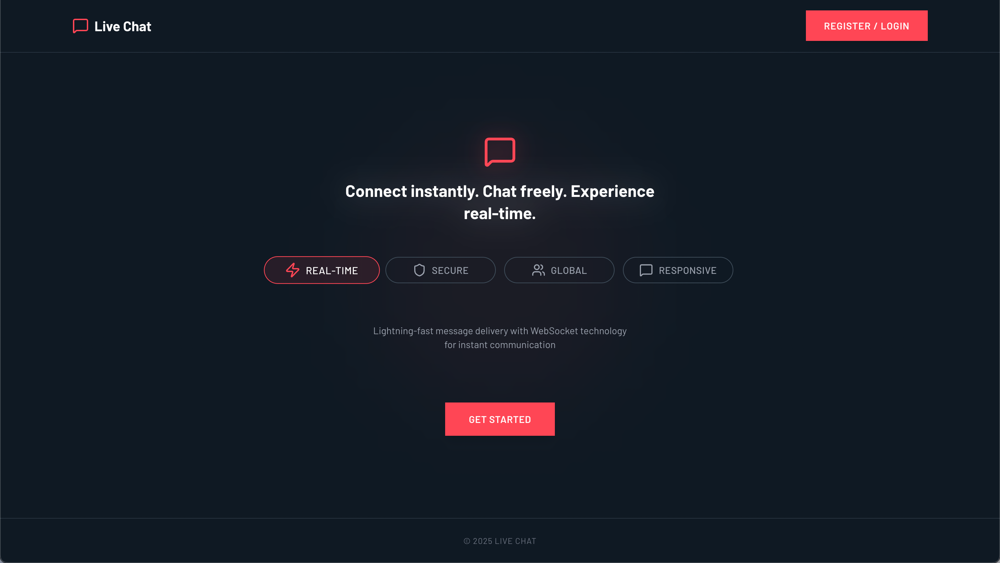
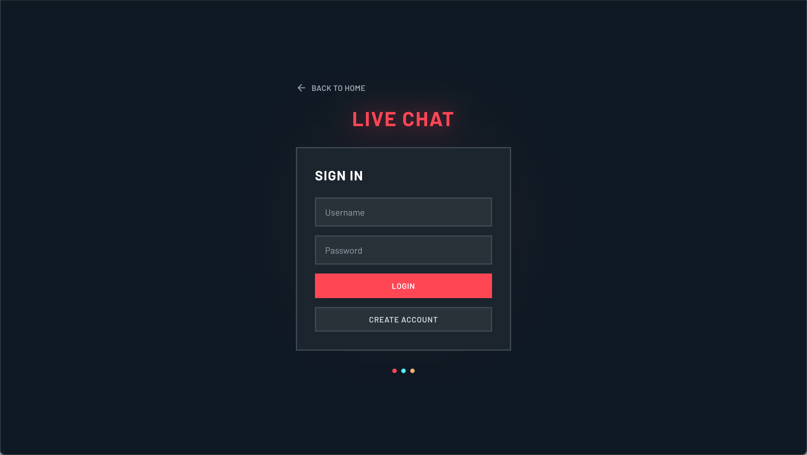
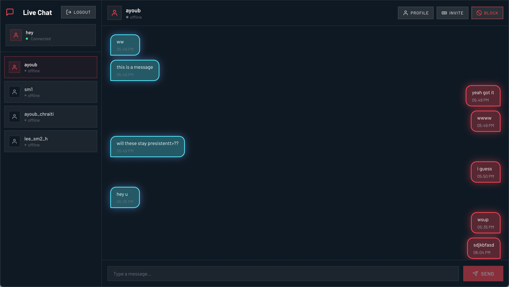

# Live-Chat

[](https://github.com/your-username/Live-Chat) [](https://github.com/your-username/Live-Chat/blob/main/LICENSE) [](https://nodejs.org/) [](https://reactjs.org/)

A real-time chat application built with **React** (frontend) and **Fastify + WebSocket** (backend).  
Users can register, log in, send messages instantly, and manage profiles in a responsive, modern UI.

## 🚀 Features

- 🔐 User authentication (register & login)
- 💬 Real-time messaging with WebSocket
- 👤 User profiles with avatars
- ⚡ Fast and lightweight backend (Fastify)
- 🌐 CORS-enabled for frontend–backend communication

---

## 🖼️ Screenshots

### Landing Page  


### Login / Register  


### Chat Interface  


---

## 🛠️ Tech Stack

**Frontend:**   

**Backend:**   

**Database:** 

---

## ⚙️ Setup

### 1. Clone the repository
```bash
git clone https://github.com/AyoubChraiti/Live-Chat.git
cd Live-Chat
```

### 2. Install dependencies
```
Frontend

cd frontend
npm install
npm run dev
```
```
Backend

cd backend
npm install
npm start
```

## 📡 Deployment

#### You can deploy the project easily using:

**Frontend:**: GitHub Pages, Netlify, or Vercel
**Backend:** Render, Railway, or your own VPS