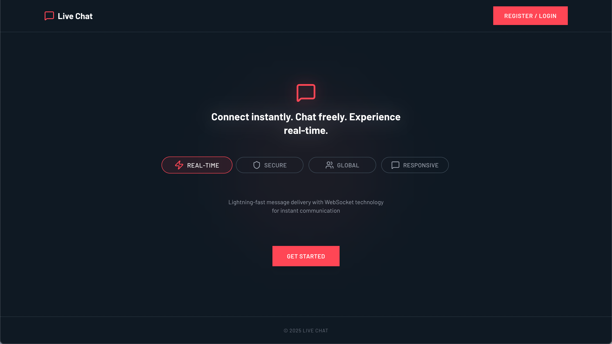
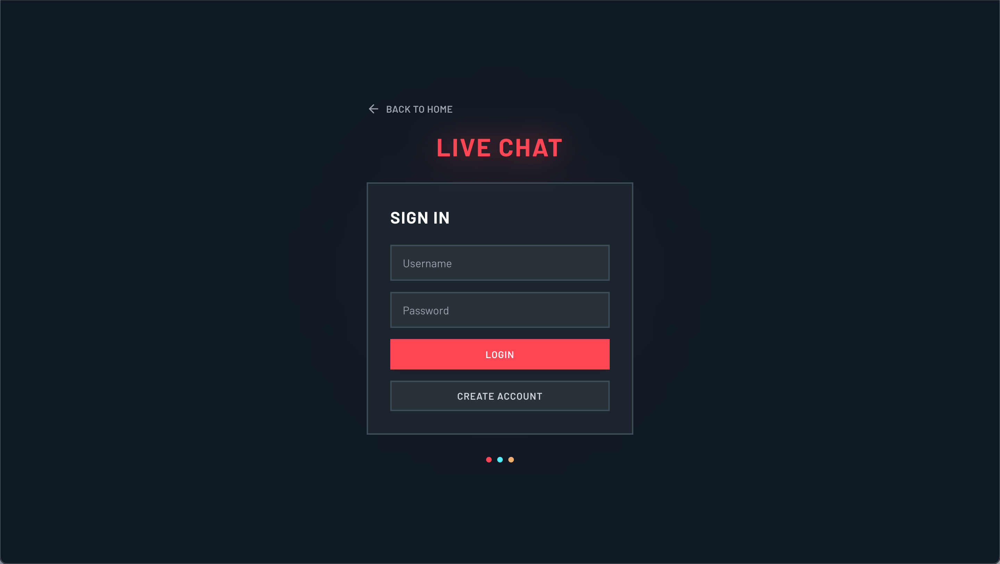
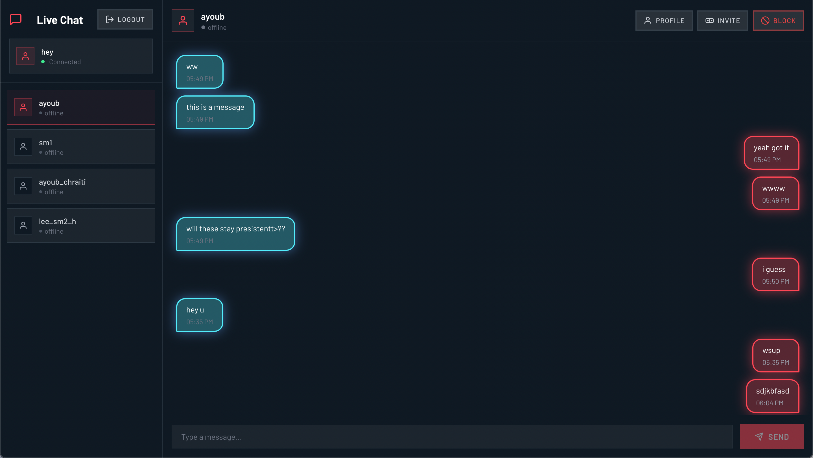

# Live-Chat

[](https://nodejs.org/) [](https://reactjs.org/)

A real-time chat application built with **React** (frontend) and **Fastify + WebSocket** (backend). Users can register, log in, send messages instantly, and manage profiles in a responsive, modern UI.

## 🚀 Features

- ⚡ Fast and lightweight backend using Fastify
- 🔐 User authentication (registration & login)
- 💬 Real-time messaging powered by WebSocket
- 👤 User profiles with avatars
- 🌐 CORS-enabled for seamless frontend–backend communication

## 🖼️ Screenshots

| Landing Page | Login / Register | Chat Interface |
|--------------|------------------|----------------|
|  |  |  |

## 🛠️ Tech Stack

**Front:**  
        

**Back:**  
        

**DB:**  
      

### Installation
```bash
git clone https://github.com/AyoubChraiti/Live-Chat.git
cd Live-Chat
```
ETC...
